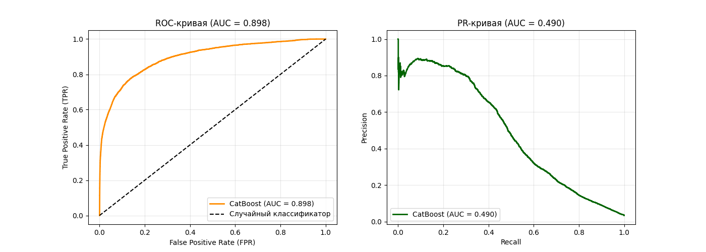

# Fraud Detection на датасете IEEE-CIS Fraud Detection

## Описание задачи

Бинарная классификация мошеннических транзакций на реальных данных от Vesta Corporation.

**Ключевые вызовы:**
- **Сильный дисбаланс классов:** только 3.5% мошеннических транзакций
- **Сложность данных:** 590k записей, более 400 признаков, много пропусков
- **Временной характер:** данные упорядочены по времени, нельзя использовать случайный сплит (риск data leakage)

---

## Данные

- **Источник:** IEEE-CIS Fraud Detection (Kaggle competition)
- **Объём:** 590 000 транзакций
- **Структура:** две связанные таблицы
  - `train_transaction.csv` — информация о транзакции (сумма, время, карта, и др.)
  - `train_identity.csv` — информация об устройстве (ОС, браузер, настройки)

---

## Подход

### 1. EDA и предобработка

| Шаг | Действие                                                          |
|-----|-------------------------------------------------------------------|
| Объединение | `left join` таблиц по `TransactionID`                             |
| Сортировка | по `TransactionDT` (время) для корректного сплита                 |
| Удаление колонок | признаки с >80% пропусков — удалены                               |
| Заполнение пропусков | категориальные -> `"MISSING"`, числовые -> оставлены для CatBoost |

### 2. Feature Engineering (15+ признаков)

Созданы агрегированные признаки на основе поведенческих паттернов:

| Признак | Гипотеза |
|---------|----------|
| `card1_count` | частота транзакций по карте (новые карты подозрительнее) |
| `card1_avg_amt` | средний чек по карте |
| `amt_to_avg_ratio` | отклонение текущей суммы от среднего |
| `time_since_last` | время с последней транзакции |
| `card1_addr1_count` | частота пары (карта, адрес) |
| `P_emaildomain_count` | частота email-домена |
| `DeviceType_count` | частота типа устройства |
| и другие | `card2_count`, `card3_count`, `addr1_count`, временные скользящие окна |

**Почему это важно:** сырые идентификаторы (`card1`, `addr1`) бесполезны сами по себе. Их агрегации превращают их в информативные признаки поведения.

### 3. Валидация

- **Временной сплит** (НЕ случайный!):
  - 80% первых данных → обучение
  - 15% от обучения → валидация
  - 20% последних данных → тест
- **Почему:** иначе модель будет использовать «будущую» информацию, что невозможно в реальной системе

### 4. Модель

```python
CatBoostClassifier(
    cat_features=final_cat_cols,
    auto_class_weights='Balanced',  # борьба с дисбалансом
    iterations=2000,
    learning_rate=0.005,
    depth=10,
    l2_leaf_reg=3,
    early_stopping_rounds=100
)
```

### 5. Результаты

Был проведен подбор оптимального порога для максимизации F1-score.  
Оптимальным оказался порог 0.8.
Построены графики ROC-AUC, PR-AUC, вычислены ключевые метрики.
### Результаты (порог 0.8)
| Метрика | Значение |
|-------|----------|
| ROC-AUC | 0.898 |
| PR-AUC | 0.490 |
| Precision | 0.583 |
| Recall | 0.447 |
| F1 | 0.506 |



- ROC-кривая показывает компромисс между True Positive Rate (Recall) и False Positive Rate.  
Чем ближе кривая к левому верхнему углу, тем лучше модель. AUC = 0.898 — отличный результат.  
- PR-кривая важнее при дисбалансе классов. Она показывает компромисс между Precision и Recall.  
Случайная модель дала бы горизонтальную линию на уровне 0.035. Наша кривая значительно выше — AUC = 0.490.

### Матрица ошибок
| | Предсказано Legit |Предсказано Fraud|
|---|-------------------|---------|
|Реально Legit| 112,745 (TN)      |	1,299 (FP)|
|Реально Fraud| 2,246 (FN)        |	1,818 (TP)|

## Интерпретация для бизнеса
| Если важнее... | Выбор | Обоснование |
|----------------|-------------------|-------------|
| …найти всех мошенников (Recall)  | Модель не подходит     | Recall 0.45 — слишком низкий |
| …не беспокоить лояльных клиентов (Precision)      | 	Модель приемлема | 58% точности — блокируем 10 клиентов, 6 из них мошенники |
|…сбалансированный вариант|Требуется улучшение|F1 0.5 — есть куда расти|

## Стек технолоигий

- Python — основной язык
- Pandas, NumPy — обработка данных
- CatBoost, scikit-learn — моделирование
- Matplotlib — визуализация
- Jupyter Notebook — среда разработки

### Запуск проекта
```bash
# Клонирование репозитория
git clone https://github.com/menataoff/fraud-detection-.git
cd fraud-detection

# Установка зависимостей
pip install -r requirements.txt

# Запуск Jupyter
jupyter notebook notebooks/fraud_detection_HARD.ipynb
```

## Вывод

Проект демонстрирует полный цикл Data Science для реальной задачи с сильным дисбалансом классов:

- EDA и очистка данных (пропуски, удаление мусорных колонок)
- Feature engineering (15+ агрегированных признаков)
- Временная валидация (защита от data leakage)
- Обучение CatBoost с балансировкой классов
- Подбор порога для максимизации F1
- Интерпретация метрик для бизнеса

Результат: ROC-AUC 0.898, PR-AUC 0.490 (в 14 раз лучше случайной модели). Модель может быть использована в системах с высокими требованиями к точности (precision) при готовности мириться с умеренным recall.

### Источник данных

[IEEE-CIS Fraud Detection (Kaggle)](https://www.kaggle.com/c/ieee-fraud-detection/data)